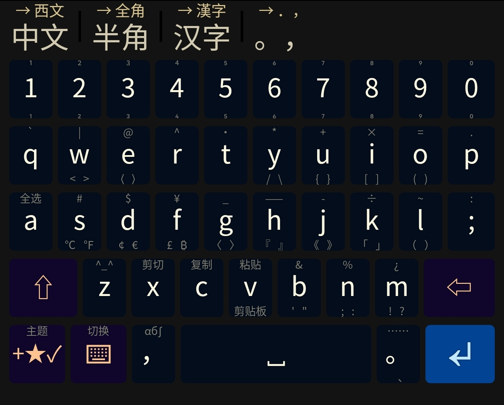
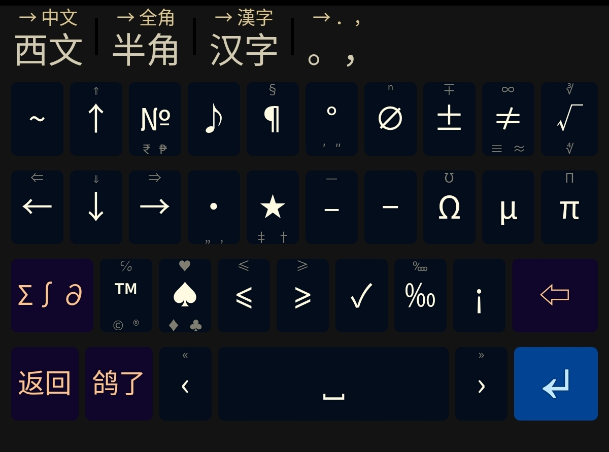
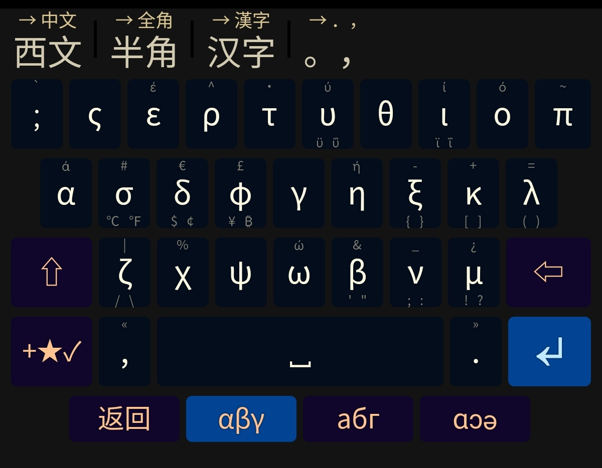

# 星天 / Astralwelkin

## 这是什么？

「星天」，一个根据作者输入习惯制作的暗色[同文输入法](https://github.com/osfans/trime)主题，适合夜间使用，虽说还是有一个亮色配色的啦。

（甚至附带了一个全是 bug 的日文十二键输入法。）

## 这里有什么？

- `tools`：处理词典所用脚本
- `rime`：本项目的主要部分
  - `lua`：lua 脚本文件夹（目前里面只有日文用的）
  - `星天.trime.yaml`：主题本体
  - `bopomofo.custopm.yaml`：用于注音的配套设置
  - `double_pinyin_mspy.custom.yaml`：用于微软双拼的配套设置
  - `japanese_12_key.dict.yaml`：日文十二键用词库
  - `japanese_12_key.schema.yaml`：日文十二键输入方案
  - `japanese.dict.7z`：日文子词库压缩包
  - `luna_pinyin.custom.yaml`：用于朙月拼音的配套设置
  - `rime.lua`：Rime 输入法用到的 lua 脚本
- `dict_source.7z`：日文词典源文件与处理后的词库

## 长什么样？

## 怎么用？

### 将它放到你的设备上

想要哪些内容？

- 我全都要！
  1. 将本项目克隆到一个合适的位置；
  2. 将 `japanese.dict.7z` 里面的词库解压到 `rime` 文件夹下；
  3. 将 `rime` 文件夹与设备上的 `rime` 文件夹合并，再重新部署即可。
- 我不用日文
  1. 将本项目克隆到一个合适的位置；
  2. 去掉 `rime` 文件夹下以 `japanese` 开头的文件以及 lua 脚本；
  3. 将 `rime` 文件夹与设备上的 `rime` 文件夹合并，再重新部署即可。

**注意：如果目录下已经存在 `*.custom.yaml` 的话，建议手动修改合并文件内容。**

### 按键说明

本主题在键上大量运用了滑动操作。

- 键上方的小字符号由长按输入；
- 键下方若只有一组符号，则通过下滑该键输入；
- 键下方若有左右两组符号，则通过左滑、右滑该键输入。

建议在设置中将「触发滑动手势的最短距离」适当调低些。

## FAQ

### 1. 键盘上面的「摆烂」「鸽了」是什么？

前者是还没想好放什么，后者是想好了但还没实现。欢迎提出建议！

### 2. 为什么没有 XXX？

可以提个 issue，当然自己动手然后提交 PR 更好。

### 3. 我有问题（建议）怎么办？

可以提个 issue 或者发个邮件。
